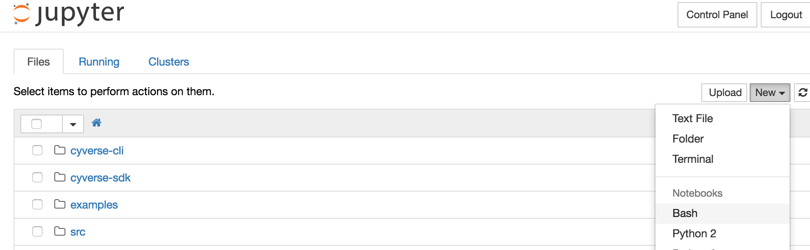

# Resources required for the workshop

## Cyverse User Account

If you do not have Cyverse credentials, they are quick and easy to get at [https://user.cyverse.org](https://user.cyverse.org).  For this workshop, they are required for connecting to Jupyterhub.  Once you have made credentials and confirmed your email address, it will take a few minutes for the account to propagate.

## Cyverse JupyterHub

The easiest way to get started is to use the hosted Cyverse JupyterHub prepared for this workshop located at https://jupyter.cyverse.agaveapi.co.  Login with your Cyverse credentials.

Once you have logged in, please open a new "bash" Notebook.



Once you have a notebook, test that everything is working with this command:

```
systems-list
```

You should get a list of some system names such as "data.iplantcollaborative.org".


## Hosted Docker

For the sake of simplicity, we will use an in-browser shell to explore Docker.  This is cheating a bit on the "no command line" rule, but you can reproduce what we do in the workshop using Kitematic or other available apps.  For today, we don't want to require using your laptop for development, but as you continue to work with Docker, having it on your own laptop is terribly convenient.


# Resources for working with Docker and the Science APIs on your own 

## Command line access

We already have this installed for you within the JupyterHub we will be using, but there is a great set of command-line utilities for the Cyverse APIs on github.  They only require bash and Python's JSON tool to work, which, if you are on a Linux or Mac system is probably already there.  Pull down the tools using git:

```
git clone https://github.com/iPlantCollaborativeOpenSource/cyverse-sdk.git
cd cyverse-sdk
tar xf cyverse-cli.tgz
mv cyverse-cli $HOME
echo "PATH=\$PATH:\$HOME/cyverse-cli/bin" >> ~/.bashrc
source ~/.bashrc
```

A full explanation of the tools, installation, and example uses is available [on GitHub here](https://github.com/iPlantCollaborativeOpenSource/cyverse-sdk/blob/master/README.md)

## Docker

# Using the Science APIs

If you use the hosted JupyterHub instance, it passes your token to the underlying Python or Bash tools when you login.  If you are accessing the Science APIs on your own, you need to follow the instructions below on selecting a tenant and setting up a client.

## Selecting a tenant

The "Agave API", which is the major component of the Cyverse Science APIs, is a multi-tenant service.  In the abstract, this means that the API can support other projects outside of Cyverse without completely replicating the infrastructure.  The practical side of this is that you need to tell the APIs which tenant you want to use.  To use the Cyverse tenant, which gives you access to quite a few system resources and a bunch of apps, you would type this:

```
tenants-init -t iplantc.org
```

Cyverse used to be called the iPlant Collaborative, and you will still see that reflected in some server names, like the one above.

## Creating a client

The Agave API uses OAuth 2 for managing authentication and authorization. Before you start working with the API on the command line, you will need to create a OAuth client application associated with a set of API keys. This is a one-time action, so if you already have a set of API keys, skip to the next tutorial. If not, you can create your keys using the Clients service as follows:

```
clients-create -S -N my_client -D "Client used for app development"
```

Note: The -N flag allows you to specify a machine-readable name for your application; -D provides the description, and -S option stores your API keys for future use, so you will not need to manually enter them when you authenticate later.

After being prompted for your username and password, you should get a response letting you know if a client key and secret was generated successfully.  If you used the "-S" flag, as in the example, the CLI tools also cached that information in the ~/.agave/ directory.

Although much of the process of interacting with the Agave API is automated, you may need access to the consumerKey and consumerSecret for other types of OAuth2-based interaction so please record them. If you lose them, you can create new copy of them for the same client by deleting the old client and creating it again. You can also have multiple OAuth2 clients - we are simply demonstrating use of one.

### Obtaining an OAuth 2 authentication token

Tokens are a form of short-lived, temporary authenticiation and authorization used in place of your username and password. To interact with CyVerse APIs, you will need to acquire one. Your Cyverse token will expire 4 hours, but can easily be refreshed.

The command to accomplish this is:

```sh
# From your terminal interface, type:
auth-tokens-create -S
```
You will then be prompted to enter your *API password*.

### Refreshing your token

When your token expires in 4 hours, you may refresh it:

```sh
auth-tokens-refresh -S
```

This topic is covered in great detail at [Authorization Guide](http://agaveapi.co/documentation/authorization-guide/) in the Agave live docs


